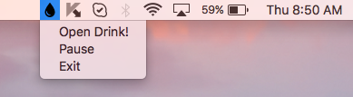
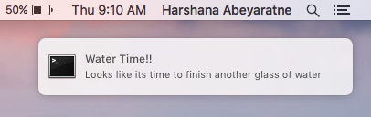

# Drink
Reminder to drink more water. Built with electron

## Screens





## To Use

To clone and run this repository you'll need [Git](https://git-scm.com) and [Node.js](https://nodejs.org/en/download/) (which comes with [npm](http://npmjs.com)) installed on your computer. From your command line:

```bash
# Clone this repository
git clone https://github.com/harshq/Drink.git
# Go into the repository
cd electron-quick-start
# Install dependencies
npm install
# Run the app
npm start
```

